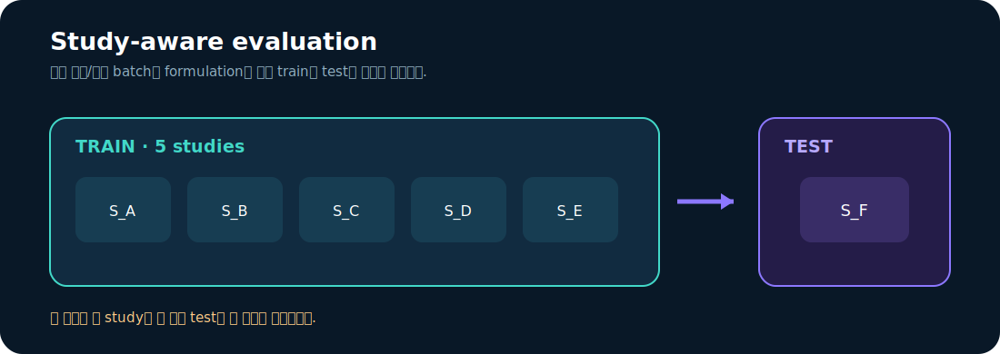
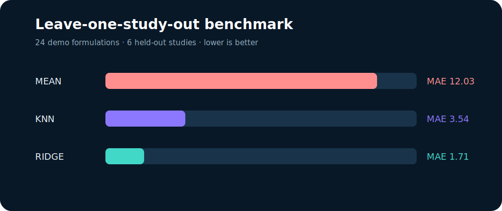

<h1 align="center">🧪 LNP Benchmark Suite</h1>

<p align="center">
  <b>Carrier × Payload × Assay를 study-aware protocol로 비교하는 경량 벤치마크</b><br/>
  데이터 누수를 막고 baseline부터 ridge까지 동일한 fold에서 평가합니다.
</p>

<p align="center">
 
 
 
 
</p>

<p align="center"></p>

## 핵심 질문

> 새로운 논문 또는 실험 batch에서 들어온 LNP formulation의 전달 효율을 얼마나 잘 예측할 수 있는가?

행을 무작위로 나누면 같은 study의 조성·assay 조건이 train과 test에 동시에 들어가 성능이
부풀 수 있습니다. 이 레포는 study 하나를 통째로 test로 남기는
**leave-one-study-out (LOSO)** 평가를 기본값으로 사용합니다.

## Quick start

```bash
pip install -e .
lnp-bench
python scripts/make_report_assets.py
python -m unittest discover -s tests -v
```

<p align="center"></p>

## 입력 feature

| 분류 | 컬럼 |
|---|---|
| Composition | ionizable/helper/cholesterol/PEG molar ratio, N/P ratio |
| Payload | mRNA·siRNA·ASO, sequence length |
| Physicochemical | particle size, PDI |
| Target | transfection percentage |
| Group | study ID |

## Public benchmark 연결

원 데이터는 라이선스를 보존하기 위해 재배포하지 않습니다. 대신 출처 registry와 canonical
schema 연결점을 제공합니다.

- [LipoBART](https://github.com/Sanofi-Public/LipoBART): ionizable-lipid representation benchmark
- [LNPDB](https://lnpdb.molcube.com/): composition–experiment–performance database
- [RNA cargo size-gradient study](https://doi.org/10.1038/s41598-024-52685-1): 10–1929 nt benchmark

자세한 범위와 이용 주의사항은 [`docs/DATA_SOURCES.md`](docs/DATA_SOURCES.md)에 있습니다.

## 산출물

```text
results/
├─ metrics.json       # protocol, N, model별 MAE/R²
└─ predictions.csv    # formulation·held-out study별 out-of-fold prediction
```

## 해석 경계

포함된 24개 formulation은 코드 실행과 누수 검사를 위한 합성 데모입니다. metric은 논문
재현 결과나 새로운 효능 주장이 아닙니다. 실제 벤치마크에서는 원 출처의 license,
study provenance, cell line, dose, route, assay 정의를 함께 고정해야 합니다.

## Benchmark 데이터 설명

### 데이터의 목적

이 저장소의 benchmark 데이터는 **LNP 조성 및 물성으로부터 RNA 전달 효율(transfection efficiency)을 예측하는 모델을 공정하게 비교하기 위한 표준 입력 예시**이다. LNP는 ionizable lipid, helper lipid, cholesterol, PEG-lipid 등 여러 성분으로 구성되며, 조성·입자 특성·탑재 cargo에 따라 세포 전달 효율이 달라진다.

따라서 이 데이터셋은 단순한 분류용 텍스트 데이터가 아니라, 다음 질문을 평가하기 위한 formulation-level regression 데이터다.

> “새로운 LNP formulation의 조성과 물성만 알고 있을 때, RNA가 세포 안으로 전달되는 비율을 어느 정도 예측할 수 있는가?”

### 포함된 데이터

실행에 사용되는 `data/demo/lnp_formulations.csv`는 공개 benchmark의 schema와 실행 흐름을 재현하기 위해 구성한 **합성 데모 데이터 24개 formulation**이다. 실제 환자 데이터나 임상 데이터가 아니며, 코드 실행과 split 전략 검증을 위한 작고 읽기 쉬운 예시다.

각 행은 하나의 LNP formulation과 하나의 assay 결과를 나타낸다.

| 컬럼 | 의미 |
|---|---|
| `formulation_id` | formulation 식별자 |
| `study_id` | 동일 실험 연구 또는 batch를 구분하는 그룹 ID |
| `payload_type` | 탑재 cargo 종류: mRNA, siRNA 등 |
| `ionizable_ratio` | ionizable lipid 조성 비율 |
| `helper_ratio` | helper lipid 조성 비율 |
| `cholesterol_ratio` | cholesterol 조성 비율 |
| `peg_ratio` | PEG-lipid 조성 비율 |
| `np_ratio` | N/P ratio. 핵산 인산기 대비 양이온성 질소 비율 |
| `payload_length_nt` | RNA payload 길이(nt) |
| `particle_size_nm` | LNP 평균 입자 크기(nm) |
| `pdi` | 입자 크기 분포의 균일도 지표 |
| `transfection_pct` | 예측 대상인 세포 전달 효율(%) |

예시 레코드는 다음과 같다.

```csv
formulation_id,study_id,payload_type,ionizable_ratio,helper_ratio,cholesterol_ratio,peg_ratio,np_ratio,payload_length_nt,particle_size_nm,pdi,transfection_pct
LNP001,S_A,mRNA,50,10,38.5,1.5,6.0,996,82,0.12,74
```

위 레코드는 특정 formulation의 조성비와 particle size/PDI, payload 길이를 이용해 `transfection_pct`를 예측하는 하나의 샘플을 의미한다.

### 왜 `study_id`가 중요한가

같은 연구 또는 같은 실험 batch에서 만들어진 formulation은 서로 비슷한 제조 조건과 assay 환경을 공유한다. 데이터를 무작위로 train/test에 나누면 동일 study의 유사 formulation이 양쪽에 동시에 들어가 모델 성능이 실제보다 높게 보일 수 있다.

이 프로젝트는 이를 방지하기 위해 `study_id` 단위의 **leave-one-study-out(LOSO)** 평가를 기본 protocol로 사용한다.

```text
Study A + Study B + Study C  → train
Study D                    → test
Study A + Study B + Study D  → train
Study C                    → test
```

즉, 모델이 이미 본 formulation과 비슷한 샘플을 맞히는 것이 아니라, 새로운 연구 조건에서 일반화되는지를 평가한다.

### 공개 데이터와의 관계

저장소에 포함된 24개 행은 라이선스와 재현성을 고려한 합성 데모다. 실제 규모의 benchmark로 확장할 때는 다음 공개 자료를 canonical schema로 변환해 사용할 수 있다.

- [LipoBART](https://github.com/Sanofi-Public/LipoBART): ionizable lipid 및 LNP 조성과 RNA transfection 예측 관련 자료
- [LNPDB](https://lnpdb.molcube.com/): LNP composition, experiment, performance metadata
- [RNA cargo size-gradient study](https://doi.org/10.1038/s41598-024-52685-1): RNA cargo 길이에 따른 전달 효율 비교 자료

실제 데이터를 연결할 때는 원문 license, 세포주, dose, 투여 경로, assay 정의, 측정 시점과 study provenance를 함께 보존해야 한다.

### 벤치마크 결과의 해석

`results/metrics.json`의 MAE, RMSE, R² 등은 해당 split protocol에서의 예측 성능을 나타낸다. 합성 데모의 작은 표본 수로 얻은 수치는 실제 LNP 개발 성능이나 임상적 유효성을 의미하지 않는다. 이 프로젝트의 핵심 산출물은 특정 숫자보다 **데이터 누수를 줄인 평가 프로토콜과 재현 가능한 비교 구조**다.
